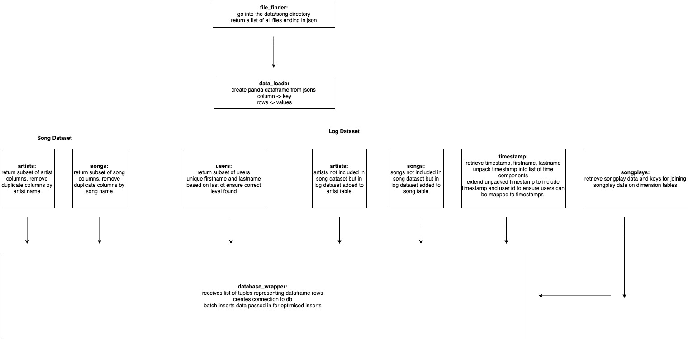
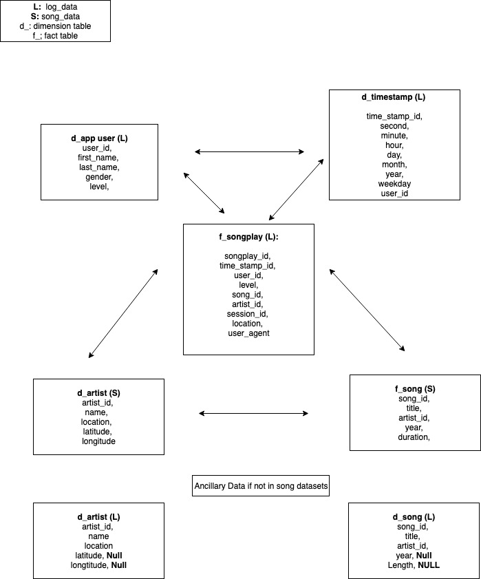

### SPARKIFY ETL 
#### Pipeline to load json data into a PSQL DB for further analysis

#### Project Overview

Music company sparkify generate JSON logs that cover how songs are played in their app. This dataset is joined with an open source songs and artist JSON collection so data analysts can identify trends in song plays.

#### App Architecture

#### Database Schema 

#### Setup

* Ensure psql and python3 are installed

* From inside the project directory create a python 3 virtual environment called venv_psql_sparkify
  
* Load the virtual environment and run pip install -r requirements.txt
  
* Run ./etl_exec.sh. This script will drop the existing tables in the DB and then recreate them. From there the python application will execute the ETL pipeline on the data in the data directory. 

#### Caveats With Current Approach

The majority of the songs played by users are missing from the songplay json files. 

As a result joining the songplay table on the song table via the song name produces very few results as the song table does not cover the songs actually played by users. 

To resolve this the following actions could be required:

* Gather an extensive dataset of songs and artists so songs played by users can be joined with this dataset
* Table denormalization. Accept that the song and artist dataset is incomplete and insert the song and artist name directly into the table

Table denormalization would be the easiest and most straightforward approach and would also reduce query complexity as joins would not be required on the artist and song dataset. 

#### Additional Steps

* Performance testing with further denormalized tables, ideally with a bigger dataset or in an environment with low ram to identify bottlenecks
* Have db and python scripts execute inside containers
* Developing unit tests alongside code to make code more production ready and increase documentation
* Incorporate the code into a jupyter server so results and dataframes can be reviewed more easily

